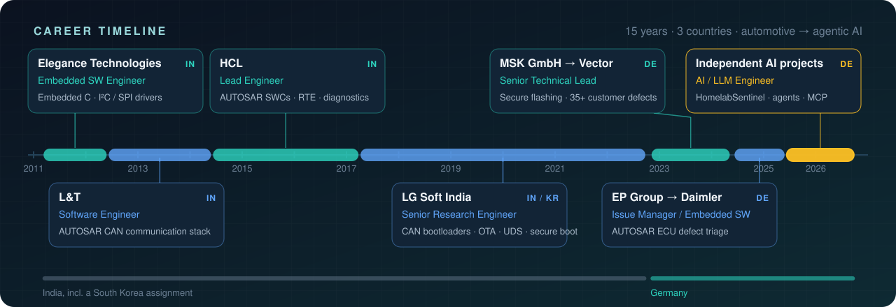

  

  
  
  

### 👋 About me

- 🛰️ Building **[HomelabSentinel](https://github.com/naveen6gowda/AI-Agent)** — a LangGraph agent that runs my homelab 24/7 and waits for my tap before any restart.
- 🚗 **11+ years of automotive embedded software** in Germany, India and South Korea — CAN, AUTOSAR, UDS, ECU bootloaders, secure flashing.
- 🧪 I care about the unglamorous parts of AI: approval gates, tests, evaluations, tracing, and alerts people actually read.
- 🏠 Everything runs locally where it can: LM Studio, Proxmox, Home Assistant and a drawer full of ESP32s.
- 🤝 Open to **AI / LLM engineering** and **embedded-AI** roles in Germany.

## 🛰️ Featured: HomelabSentinel

https://github.com/user-attachments/assets/61a1c8c4-5873-426c-a629-a09e716ecd6f

<table>
  <tr>
    <td align="center" width="25%"><b>🛡️ Default deny</b> every destructive action waits for a human</td>
    <td align="center" width="25%"><b>🔌 MCP server</b> same tools, same gate, for any AI client</td>
    <td align="center" width="25%"><b>🧪 Tests + evals</b> pytest in CI · 12 golden scenarios</td>
    <td align="center" width="25%"><b>🏠 100% local LLM</b> LM Studio · Langfuse traces</td>
  </tr>
</table>

## 📌 Repositories

<table>
  <tr>
    <td width="50%" valign="top">
      <h3><a href="https://github.com/naveen6gowda/AI-Agent">🛰️ AI-Agent</a></h3>
      HomelabSentinel source: LangGraph approval gate, 29-tool registry, MCP server, BM25 RAG, systemd monitors, eval harness and a five-step “how to build an agent” course.  
         
    </td>
    <td width="50%" valign="top">
      <h3><a href="https://github.com/naveen6gowda/Portfolio">🧭 Portfolio</a></h3>
      Case study, production lessons, nine ESPHome device configs, a 24-service Docker reference, homelab architecture, PCB notes and my full career history.  
         
    </td>
  </tr>
</table>

## 🧰 Tech stack

  

**AI:** LangGraph · LangChain · MCP · RAG (BM25) · Pydantic · Langfuse · LM Studio · llama.cpp · Ollama · LLM evaluation 
**Automotive:** Embedded C · CAN · AUTOSAR Classic · UDS · MISRA C · Trace32 · CANoe · DaVinci Configurator Pro · ISO 26262 · ISO 21434 
**Platform & IoT:** Proxmox · OPNsense · Tailscale · Home Assistant · ESPHome · ESP32 · MQTT · n8n · KiCad

## 🚗 Career

  

English C2 · German A2 (improving) · Kannada native · Based in Germany

